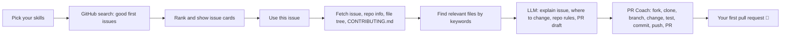

# 🌱 First-PR Mentor

**From "I want to contribute" to your first PR.**

## The problem

Millions of students want to contribute to open source, but most never make a first pull request because:

- **They don't know where to start.** Which project? Which issue?
- **They can't understand the code.** Even a "good first issue" can feel like reading another language.
- **They fear making mistakes.** Forks, branches, commits, PR templates... one wrong step feels public and permanent.

Existing tools only list "good first issues". They stop right where the hard part begins.

## The solution

First-PR Mentor finds issues that match your skills, **explains the issue and the code in simple words**, shows **which files to open**, summarizes the repo's rules, and walks you **step by step to a real pull request**, with a ready-to-paste PR title and description.

## Features

- 🔎 **Skill-matched issue finder**: ranks fresh, unassigned "good first issue"s by your skills, repo popularity, recent activity, and how small the issue is
- 💡 **Plain-language explanation** with difficulty, time estimate and beginner-friendliness score
- 📂 **"Where to look"**: likely files with reasons (never invented: paths must come from the repo's real file tree)
- 📜 **Repo rules in 5 bullets** from CONTRIBUTING.md
- 🧭 **PR Coach**: checklist from fork to pull request with copy-paste commands and a progress bar
- ✍️ **Auto-drafted PR title and description** following the repo's rules
- 🎬 **Demo mode**: runs entirely offline from sample data, so demos never break
- 🔌 **Any LLM**: local Ollama or a hosted API, switched with environment variables

## How it works



## Tech stack

- Python 3.10+, [Streamlit](https://streamlit.io) UI
- GitHub REST API via `requests`
- LLM via the OpenAI-compatible `openai` client (Ollama, OpenAI, Groq, OpenRouter, ...)
- `python-dotenv` for secrets

## Setup

```bash
# 1. Clone
git clone https://github.com/<your-username>/first-pr-mentor.git
cd first-pr-mentor

# 2. Create a virtual environment
python -m venv .venv
source .venv/bin/activate        # Windows: .venv\Scripts\activate

# 3. Install dependencies
pip install -r requirements.txt

# 4. Configure
cp .env.example .env             # Windows: copy .env.example .env
# then edit .env: add your GITHUB_TOKEN and LLM_* settings

# 5. Run
streamlit run app.py
```

**Local LLM (free):** install [Ollama](https://ollama.com), run `ollama pull llama3.1:8b`, and keep the defaults in `.env.example`.
**Hosted LLM:** set `LLM_BASE_URL`, `LLM_API_KEY` and `LLM_MODEL` to your provider's values.

> Secrets live only in `.env` (which is git-ignored). The app never prints or logs tokens.

## Usage

1. **Find an Issue**: choose your skills, click *Find issues*, then *Use this issue*.
2. **Understand an Issue**: click *Analyze* to get the explanation, files to look at, and repo rules.
3. **PR Coach**: enter your GitHub username and tick off each step until your PR is open.

No setup yet? Tick **Demo mode** in the sidebar, or click **Try an example**, to see everything with sample data.

## Demo

- Screenshots: `docs/screenshot-find.png`, `docs/screenshot-understand.png`, `docs/screenshot-coach.png` *(add yours here)*
- Video: *(add your demo video link here)*

## Roadmap

- [ ] Search by topic and project size, not just language
- [ ] Look inside file contents (not only paths) to find relevant code
- [ ] Check your fork's progress automatically via the GitHub API
- [ ] Review your diff before you open the PR
- [ ] Multi-language explanations

## Contributing

We're beginner-friendly! See [CONTRIBUTING.md](CONTRIBUTING.md).

## License

[MIT](LICENSE)
